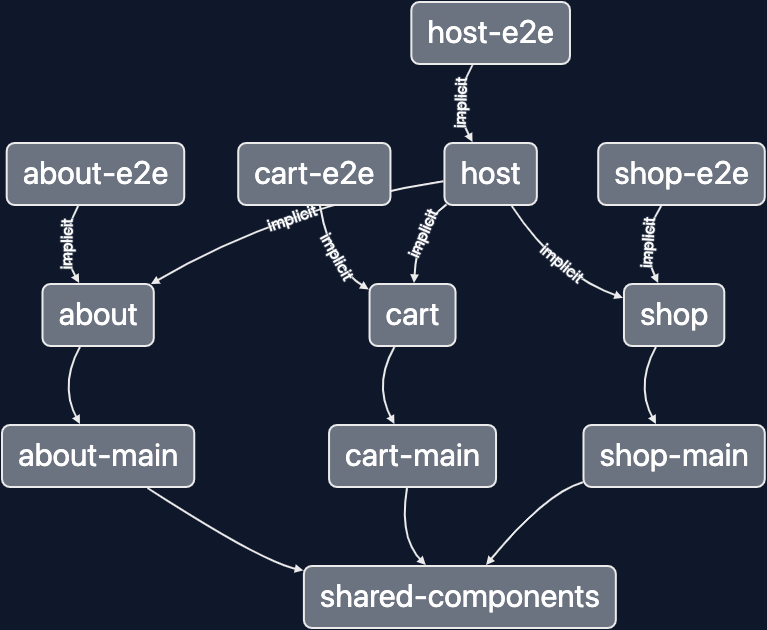

# Speeding Up React Builds Using Module Federation

WebPack module federation can be used to develop independently deployable micro frontends and speed up the build commands. This repo demonstrates the latter.

This repo contains an application built out of 4 libraries: `about-main`, `cart-main`, `shop-main` and `shared-components`.
It illustrates a system created by three teams who works on each feature:
- `shop`
- `cart`
- `about`

> We have a single lib in the repo, but each team could have hundreds of libs

Typically, all the four libraries would be included into the same application and bundled as part of a single WebPack
build. This means:

* All the libraries have to be compiled and bundled together, on one machine, from scratch. Nothing can be reused across CI runs, and nothing can be split across multiple machines. This means that the build time will increase as the application grows and can easily reach 20-30m.

* All the libraries have to be compiled and served when running the serve command locally. This means that the serve
  command will keep getting slower as the application gets larger and can easily reach 5-10m.

Module federation can solve both the problems.

To show how, we split the application into 3 remotes: `about`, `cart`, and `shop`, and the `host` project. The `host`
project has an implicit dependency on each remote. The repo also makes the `shared-components` library buildable.

## Serving Locally

If you run `nx serve host`, the executor will build all the remotes first. Then, if the remotes are available in the
cache (local or remote), the executor will restore them from the cache. All the remotes in the case are loaded and are
available in the application, but they are static and cannot be changed. This is great for running e2e tests in CI
but not useful for local development.

If you run `nx serve host --devRemotes=shop,cart`, the executor will build (or fetch from cache) `about`. Additionally, it will start two dev servers, one for `shop` and another one for `cart`. This is because the `about` remote is static, while `shop` and `cart` will watch
for file changes.

In an extensive enough system (with say 10-20 remotes), you will often only work on 1 of them, but you still need the rest for the system to work. For instance, the remote you are working on might be only accessible via other remotes.
Because you will only run your remote in the dev mode, and other remotes will be retrieved from the cache, you will be able
to run the serve command, 10-20 times faster and see the app reflect your file changes 10-20 times faster.

This gives you a good developer experience: the whole app is available, but only the part you are working on is
served and watched. The rest is "served" from the cache, so it is *free* (CPU and RAM wise). So your serve command now can take a minute instead of 10 minutes and only require 4GB of RAM instead of 16.

Note, for this to work well in practice; you should get cache hits for other remotes most of the time (rebuilding every remote independently is slower than building everything together), which means that you should have some distributed caching set up.

## Building in CI

Using this approach improves the CI performance for two reasons:

* Most PRs will only rebuild a few remotes, not all of them, and the remaining will be retrieved from the cache.
* Every remote can be built on a separate machine, in parallel. So even PRs that change most/all remotes will get
  significantly faster.

This repo enables Nx Cloud's distributed tasks execution. For example this is what is going to happen if you say change every single lib in the repo.

One of the agents will start building `shared-components`. While the components are being built, no remotes can be built cause they consume `shared-components` from its dist folder. So other agents will start running unit tests and lint checks. When `shared-components` is built, one agent will start building the about remote, another one will start on cart, etc. When all the remotes are build, some agent is going to build the host, which then can be deployed or used for e2e tests. Note all of this happens transparently without your having to configure anything.

As a result, the worst case scenario build time is: `buildOf(shared-components) + buildOf(slowest remote) + buildOf(host)` which in practice ends up being significantly faster than building the whole system (often 3-4 times faster). The average build time (where components haven't changed) gets even faster: `buildOf(average remote) + buildOf(host)`.

## E2E tests

As you can see in the project graph above, there are four e2e test projects in the repo: one for each remote and one for the host. Having a suite per remote allows us to distribute e2e tests across machines to make them faster and only to run the suites that could be affected by a PR.

Because of Nx Cloud's caching, every e2e test suite isn't going to rebuild the system from scratch. Instead will get it from the cache.

## Read More

* [Read this guide about module federation and faster builds](https://nx.dev/module-federation/faster-builds)